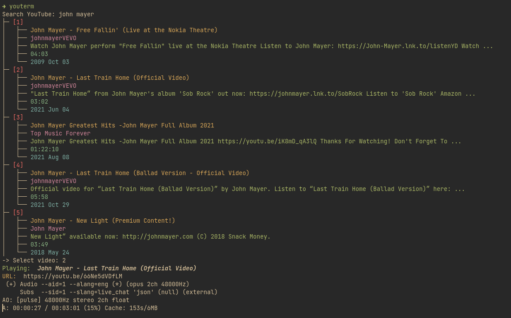

# YouTerm

CLI tool to search for [YouTube](https://youtube.com) videos and play selected
video/audio via `mpv`.



## Requirements

### YouTube API

This script retrieves video informations using YouTube APIs. An API key is
needed. You can obtain one registering a Google develper profile, adding a
project and creating an API key adding the _YouTube Data API v3_ service at
[this](https://console.cloud.google.com/apis/dashboard) link.

### Dependencies

This script does not rely on external Python dependencies, although it uses
external programs to provide audio streaming:

- `mpv`
- `youtube-dl` or `yt-dlp`

### Optional dependencies

To store the _YouTube_ API safely the _unix standard password manager_ `pass`
is required. `youterm` looks for one password entry containing the API key at
`api/youtube` in the password-store[^1]. Alternatively you can pass the API key
as a flag to the program (see [Usage](#Usage)) or hardcode it editing the
source code[^2]).

[^1]: Create entry using `pass insert api/youtube`
[^2]: _Not recommended_

## Installation

Install `youterm` using `pip`:
```bash
pip3 install youterm
```

## Usage

Invoking `youterm` with no flags defaults to audio only. Below the usage:
```
usage: youterm [-h] [-v] [-r <n>] [-a <api_key>]

CLI tool to search for YouTube videos and play selected video/audio via MPV

options:
  -h, --help            show this help message and exit
  -v, --video           Play video
  -r <n>, --results <n>
                        Number of search results displayed
  -a <api_key>, --api <api_key>
                        YouTube Data v3 API key
```
